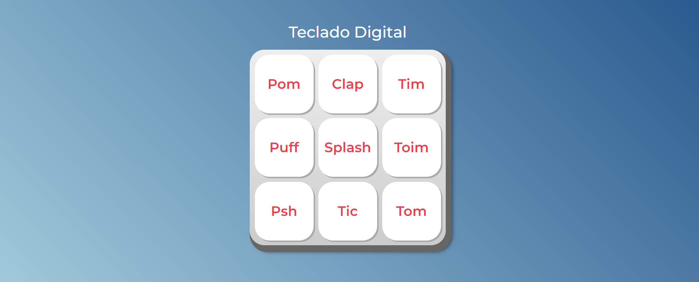

<h1 align="center"> Teclado Virtual </h1>

# Resumo do projeto

Projeto desenvolvido para estudo de JavaScript do curso de JavaScript da empresa Alura.

O sistema permite a reprodução de diferentes sons ao clicar em cada um dos botões.

## ✔️ Técnicas e tecnologias utilizadas

- ``HTML``
- ``JavaScript``
- ``Css``

## Visão do sistema

